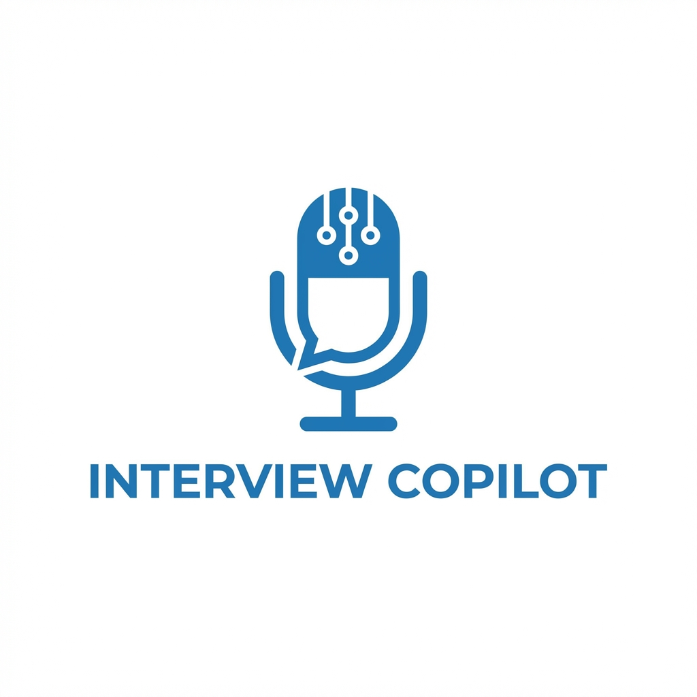
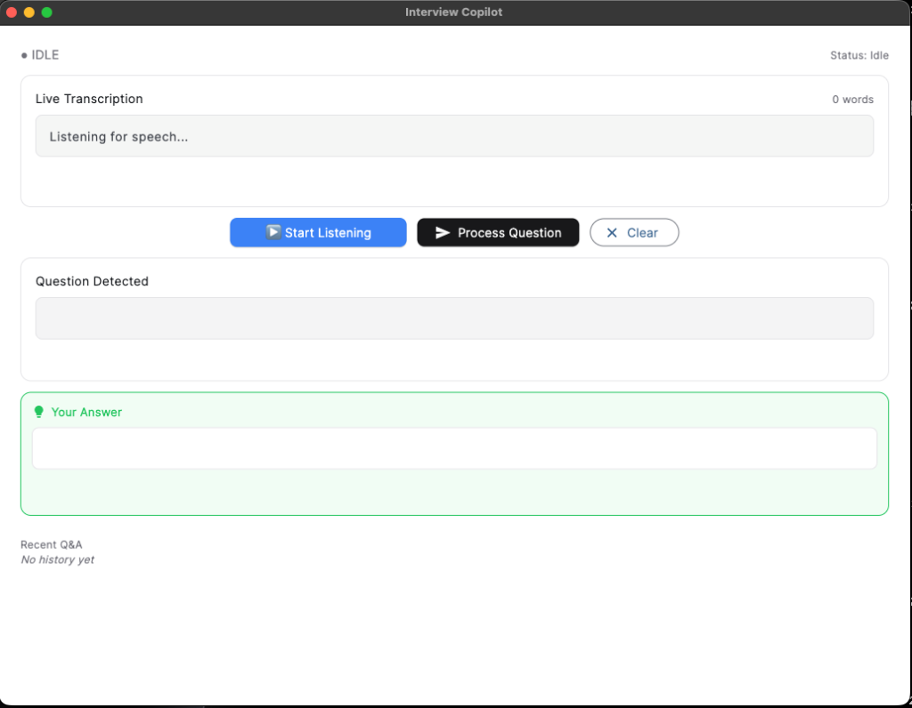

<p align="center">
  
</p>
<p align="center">
  <h1 align="center">Interview Copilot</h1>
  <p align="center">
    <em>Real-time AI-powered interview assistant</em>
  </p>
  <p align="center">
    <a href="#features"></a>
    <a href="#tech-stack"></a>
    <a href="#tech-stack"></a>
    <a href="#tech-stack"></a>
    <a href="LICENSE"></a>
  </p>
</p>

<p align="center">
  
</p>

---

## ✨ Features

- **🎤 Real-time Transcription** - Uses Vosk for fast, offline speech-to-text
- **🤖 AI-Powered Responses** - Generates contextual answers using Ollama (llama3.2)
- **🖥️ Modern UI** - Clean, minimal Flet-based interface with shadcn-inspired design
- **⌨️ Keyboard Shortcuts** - Quick controls for seamless interview flow
- **🔒 Privacy-First** - All processing happens locally, no data sent to cloud
- **🎧 System Audio Support** - Capture audio from any source using BlackHole

---

## 🚀 Quick Start

### Prerequisites

1. **Python 3.8+**
2. **Ollama** - Local LLM server
   ```bash
   brew install ollama
   ollama pull llama3.2:1b
   ollama serve
   ```
3. **BlackHole** (for system audio capture on macOS)
   ```bash
   brew install blackhole-2ch
   ```

### Installation

```bash
# Clone the repository
git clone https://github.com/SemiAutomat1c/interview-copilot.git
cd interview-copilot

# Create virtual environment
python3 -m venv venv
source venv/bin/activate

# Install dependencies
pip install -r requirements.txt

# Create your configuration
cp config.example.json config.json
```

Edit `config.json` with your profile:
```json
{
  "my_profile": "Your experience and skills...",
  "job_context": "Role you're interviewing for..."
}
```

### Run

```bash
python main.py
```

---

## ⌨️ Keyboard Shortcuts

| Key | Action |
|:---:|--------|
| `S` | Start/Stop listening |
| `Space` / `Enter` | Process current transcription |
| `Escape` | Clear transcription buffer |

---

## 🎧 Audio Setup (macOS)

To capture system audio (e.g., from Zoom, Google Meet):

1. **Install BlackHole:**
   ```bash
   brew install blackhole-2ch
   ```

2. **Create Multi-Output Device:**
   - Open **Audio MIDI Setup** (Spotlight → "Audio MIDI Setup")
   - Click **+** → Create Multi-Output Device
   - Check your speakers/headphones AND BlackHole 2ch
   - Set as your system output

3. **Configure in config.json:**
   ```json
   {
     "audio_settings": {
       "use_system_audio": true,
       "device_name": "BlackHole"
     }
   }
   ```

---

## ⚙️ Configuration

| Setting | Description |
|---------|-------------|
| `my_profile` | Your professional background and skills |
| `job_context` | The role and company you're interviewing for |
| `ollama_settings.model` | LLM model to use (default: `llama3.2:1b`) |
| `transcription_settings.engine` | Speech engine (`vosk`) |

<details>
<summary>Full config.json example</summary>

```json
{
  "my_profile": "5 years Python development experience...",
  "job_context": "Senior Python Developer role at AI Startup...",
  "system_instruction": "Custom instructions for the AI",
  "ollama_settings": {
    "model": "llama3.2:1b",
    "temperature": 0.3,
    "max_tokens": 80
  },
  "gui_settings": {
    "window_width": 800,
    "window_height": 800
  },
  "transcription_settings": {
    "engine": "vosk",
    "vosk_model": "small"
  }
}
```
</details>

---

## 📁 Project Structure

```
interview-copilot/
├── main.py              # Application entry point
├── config.json          # Your configuration (gitignored)
├── config.example.json  # Example configuration
├── requirements.txt     # Python dependencies
├── src/
│   ├── audio_handler.py # Audio capture and processing
│   ├── vosk_handler.py  # Speech recognition with Vosk
│   ├── llm_client.py    # Ollama integration
│   ├── gui.py           # Flet UI components
│   └── config_loader.py # Configuration loader
└── assets/
    └── screenshots/     # Documentation images
```

---

## 🛠️ Tech Stack

| Component | Technology |
|-----------|------------|
| UI Framework | [Flet](https://flet.dev/) |
| Speech Recognition | [Vosk](https://alphacephei.com/vosk/) |
| LLM Inference | [Ollama](https://ollama.ai/) |
| Audio Capture | [PyAudio](https://pypi.org/project/PyAudio/) |

---

## Credits

Built with [OpenCode](https://opencode.ai) - The open source AI coding agent.

## 📝 License

MIT License - feel free to use this for your own interview prep!

---

## 🤝 Contributing

Contributions welcome! Please feel free to submit a Pull Request.

---

<p align="center">
  <strong>⚠️ Disclaimer</strong><br>
  <em>This tool is meant for interview preparation and practice. Use responsibly and ethically during actual interviews based on the policies of the company you're interviewing with.</em>
</p>
